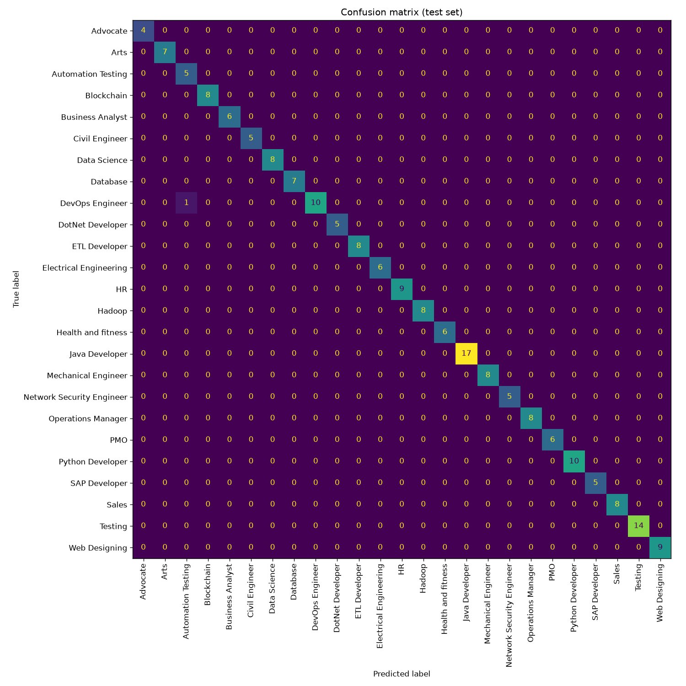

# 🧭 Resume Job-Fit Analyzer

**Does this resume actually fit this job?** This app answers that in two ways at once:
a **trained machine-learning classifier** predicts the resume's job category (with confidence),
and a **local large-language-model (LLM) critique** scores the fit against a specific job
description — flagging skill gaps, highlighting strengths, and rewriting weak bullet points.
Everything is wrapped in a clean, paste-and-go [Streamlit](https://streamlit.io) web UI.

> Built as an end-to-end portfolio project to demonstrate practical ML engineering **and**
> generative-AI integration — from data cleaning and model evaluation through to a usable product.

---

## ✨ What it does

Paste a candidate's resume and a target job description, click **Analyze fit**, and get:

| Component | Output |
|-----------|--------|
| 📊 **ML classifier** | Predicted job category + confidence, plus the top-3 alternative categories |
| 🤖 **LLM critique** | A 0–100 fit score & verdict, matching strengths, concrete skill gaps, and quantified bullet-point rewrites tailored to the job |

---

## 🎯 What this project demonstrates

This was built to show real engineering judgment, not just "it runs":

- **End-to-end ML pipeline** — raw text → cleaning → TF-IDF features → classifier, all inside a single
  saved scikit-learn `Pipeline`.
- **No train/serve skew** — the exact same preprocessing is reused at inference because it lives
  *inside* the saved model artifact (a deliberate design choice that prevents a classic production bug).
- **Honest evaluation** — the dataset is small and imbalanced, so the project leads with **macro-F1**
  and a **confusion matrix** rather than a flattering headline-accuracy number, and handles imbalance
  with `class_weight="balanced"`.
- **Generative-AI integration** — a local LLM (via [Ollama](https://ollama.com)) is constrained to
  return **structured JSON**, which is normalized so the UI always receives the keys it expects.
- **Graceful degradation** — if the LLM isn't running, the app shows a clear message instead of
  crashing; the classifier still works on its own.
- **Privacy-friendly** — the LLM runs **locally**; resumes never leave the machine.

---

## 📈 Results

The classifier was trained on the public Kaggle "Resume Dataset" (~960 resumes across 25 job
categories). On a held-out test set:

- **Accuracy ≈ 0.99** &nbsp;•&nbsp; **Macro-F1 ≈ 0.99**



> ⚠️ **Honest caveat:** these scores are high partly because the dataset is small, clean, and the
> categories are fairly distinct. The per-class report and confusion matrix
> ([`reports/classification_report.txt`](reports/classification_report.txt)) are the real story —
> not the headline accuracy. Treating evaluation this way *is* part of the point of the project.

---

## 🧩 How it works

```
        Resume text
            │
            ▼
   ┌───────────────────┐
   │  clean → TF-IDF →  │   scikit-learn Pipeline (saved as one artifact)
   │ LogisticRegression │   → predicted category + confidence
   └───────────────────┘
            │
Resume + Job description
            │
            ▼
   ┌───────────────────┐
   │   Local LLM        │   Ollama, JSON-constrained prompt
   │  (recruiter coach) │   → fit score, gaps, strengths, bullet rewrites
   └───────────────────┘
            │
            ▼
        Streamlit UI
```

## 🛠️ Tech stack

**Python** · **scikit-learn** (TF-IDF + LogisticRegression) · **pandas / NumPy** ·
**matplotlib** (evaluation plots) · **Ollama** (local LLM) · **Streamlit** (UI) · **joblib** (model persistence)

---

## 📂 Project layout

```
.
├── app.py                  # Streamlit UI
├── requirements.txt
├── .env.example            # copy to .env
├── data/                   # place UpdatedResumeDataSet.csv here (not committed)
├── models/                 # trained pipeline.joblib lands here (generated, not committed)
├── reports/                # classification_report.txt + confusion_matrix.png (shown above)
└── src/
    ├── preprocess.py       # shared text cleaning (train == serve)
    ├── train.py            # train + evaluate + save the pipeline
    ├── classifier.py       # inference wrapper
    └── llm_critique.py     # Ollama structured-JSON critique
```

---

## 🚀 Run it locally

Requires Python 3.10+ (developed and tested on 3.14, Apple Silicon).

```bash
# 1. Environment
python3 -m venv .venv
source .venv/bin/activate
pip install -r requirements.txt
cp .env.example .env                 # adjust if needed

# 2. Get the dataset
#    Download the Kaggle "Resume Dataset" (~960 resumes, ~25 categories)
#    and save it as data/UpdatedResumeDataSet.csv (columns: Category, Resume).

# 3. Train the classifier  → writes models/pipeline.joblib + the reports/
python src/train.py

# 4. (Optional) Set up the local LLM for the critique
#    Install Ollama from https://ollama.com, then:
ollama pull llama3.1:8b              # matches OLLAMA_MODEL in .env

# 5. Launch the app
streamlit run app.py
```

The dataset and the trained model are intentionally **not** committed (they're large / licensed /
regenerable) — the steps above reproduce them in a couple of minutes.

---

## 🔭 Possible extensions

Deliberately scoped to ship something solid first; natural next steps would be:

- Batch-score one resume against many postings and rank by fit.
- Schema-validate the LLM JSON output.
- Add a second classifier (e.g. LinearSVC) to compare metrics head-to-head.

---

*Built by Surya. Feedback and questions welcome.*
